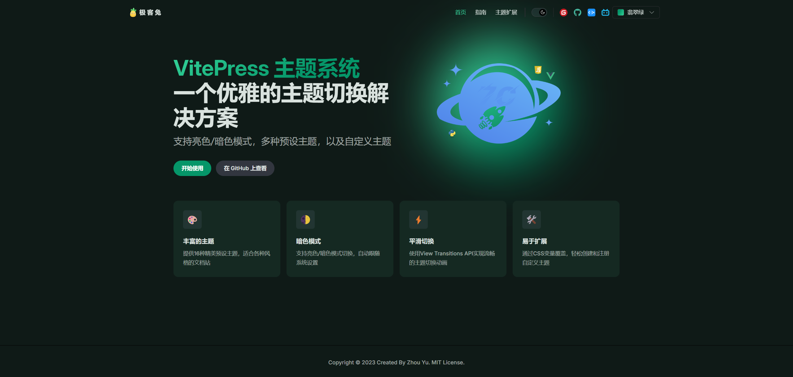

# VitePress 多彩主题

<p align="center">
  
</p>

<p align="center">
  <a href="https://www.npmjs.com/package/vitepress-colorful-themes"></a>
  <a href="https://github.com/ZhouYu2156/vitepress-colorful-themes/blob/main/LICENSE"></a>
  <a href="https://www.npmjs.com/package/vitepress-colorful-themes"></a>
</p>

[English](./README.md) | 中文

## Effects





### And more ... waiting for you to discover (等待你来发现)

---

一个为 VitePress 提供 16 种精美预设主题和平滑主题切换动画的主题扩展。

## 特性

- 🎨 16种精美预设主题
- 🌓 支持亮色/暗色模式
- 🔄 使用View Transitions API实现平滑主题切换动画
- 💾 主题偏好持久化存储
- 🌈 移动设备友好的主题选择器

## 安装

```bash
# npm
npm install vitepress-colorful-themes

# yarn
yarn add vitepress-colorful-themes

# pnpm
pnpm add vitepress-colorful-themes
```

你还需要安装Element Plus和相关插件以支持组件自动导入：

```bash
# npm
npm install element-plus @element-plus/icons-vue
npm install -D unplugin-auto-import unplugin-vue-components

# yarn
yarn add element-plus @element-plus/icons-vue
yarn add -D unplugin-auto-import unplugin-vue-components

# pnpm
pnpm add element-plus @element-plus/icons-vue
pnpm add -D unplugin-auto-import unplugin-vue-components
```

## 使用方法

1. 创建或修改 `.vitepress/theme/index.ts` 文件：

```ts
import type { Theme } from 'vitepress'
import ColorfulTheme from 'vitepress-colorful-themes'

// 方式一：直接导入再导出
export default ColorfulTheme

// 方式二：扩展自定义配置
export default {
  extends: ColorfulTheme,
  Layout, // 如需要可以使用自定义布局
  enhanceApp({ app, router, siteData }) {
    // 你的自定义应用增强
  },
} satisfies Theme
```

2. 在 `.vitepress/config.mts` 中配置 Element Plus 的自动导入：

```ts
import { defineConfig } from 'vitepress'
import AutoImport from 'unplugin-auto-import/vite'
import Components from 'unplugin-vue-components/vite'
import { ElementPlusResolver } from 'unplugin-vue-components/resolvers'

export default defineConfig({
  // ... 你的其他配置
  vite: {
    plugins: [
      AutoImport({
        resolvers: [ElementPlusResolver()],
      }),
      Components({
        resolvers: [ElementPlusResolver()],
      }),
    ],
    // 确保你的VitePress可以解析TypeScript文件
    resolve: {
      extensions: ['.mjs', '.js', '.ts', '.jsx', '.tsx', '.json', '.vue']
    }
  },
})
```

> **重要提示**：Element Plus的自动导入配置是必不可少的！如果没有正确配置，主题选择器下拉菜单将无法正常工作。

3. 启动 VitePress 开发服务器：

```bash
npm run docs:dev
```

## 更新日志

### v1.2.0 (2024-03-28)
- 🎨 **优化**: 通过直接使用CSS变量简化主题样式机制
- 🧩 **架构**: 移除冗余的基于类的样式覆盖，改用CSS变量
- 🚀 **性能**: 更高效的主题系统，减少CSS代码
- 📱 **适配**: 改善森林绿、暖阳金和玫瑰红主题在暗色模式下的体验

### v1.1.1 (2024-03-27)
- 🐞 **修复**: 改进森林绿、暖阳金和玫瑰红主题在暗色模式下的导航链接悬停和激活状态
- 🎨 **增强**: 为侧边栏链接添加悬停和激活状态样式，提升用户体验
- 📱 **UI**: 优化特殊主题在暗色模式下的整体导航一致性

### v1.0.6 (2024-03-26)
- 🐞 **修复**: 改进森林绿、暖阳金和玫瑰红主题在暗色模式下的文字对比度
- 🎨 **增强**: 提高所有主题在暗色模式下的按钮文字可见性
- 📱 **UI**: 优化暗色模式下的导航链接和特性区域对比度

### v1.0.2 (2024-03-25)
- 🎨 **优化**: 改进品牌按钮样式，增加字重至 600，使其更圆润、更易读
- 🖋️ **排版**: 优化全站字体，添加中文字体支持，提高整体可读性和美观度
- 📱 **适配**: 增强导航栏项文字样式，提供更一致的视觉体验
- 🧩 **界面**: 添加自定义滚动条样式，细腻圆润，支持亮色/暗色模式

### v1.0.1 (2024-03-23)
- 🐞 **修复**: 修复了亮色模式下品牌按钮文字颜色对比度不足的问题，现在按钮文字在所有主题和模式下都清晰可见
- 📖 **文档**: 添加了关于主题切换的详细说明文档

### v1.0.0 (2024-03-20)
- 🎉 **发布**: 首次发布，包含16种预设主题和主题管理系统
- ✨ **功能**: 支持亮色/暗色模式，主题持久化和平滑过渡效果

## 许可证

[MIT](./LICENSE) 许可证 © 2023 [ZhouYu](https://github.com/ZhouYu2156) 